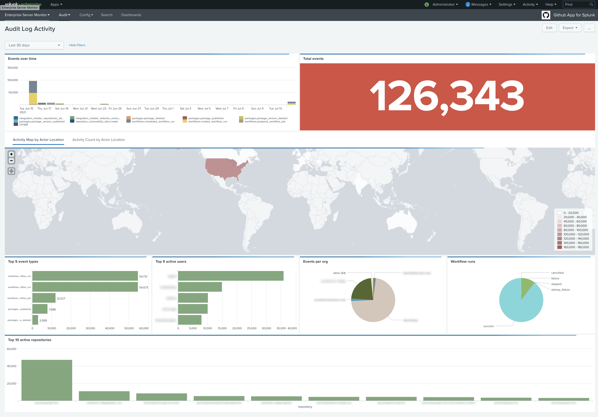
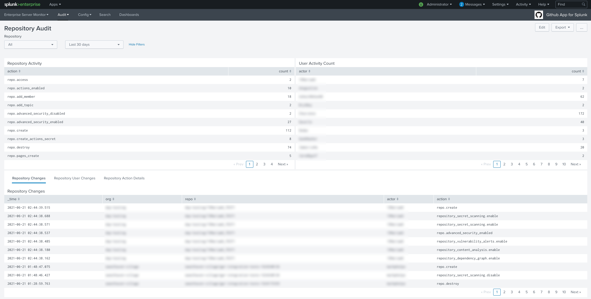
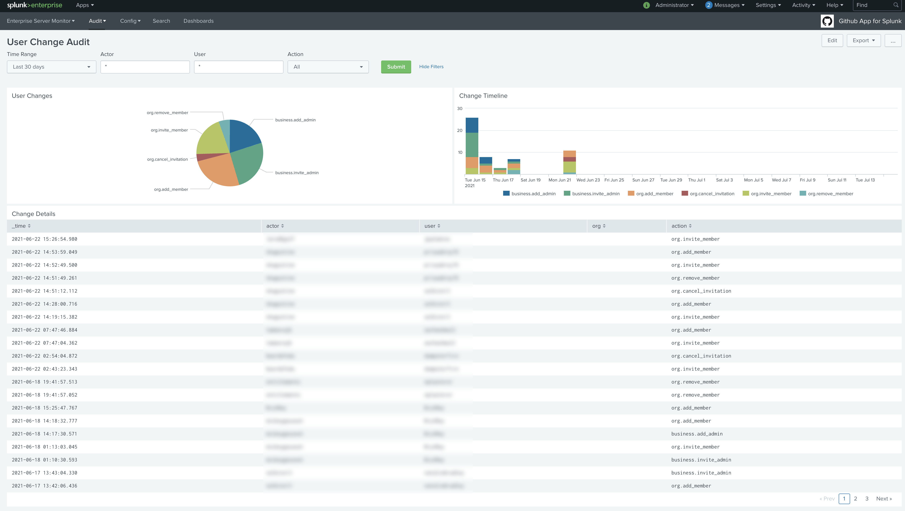
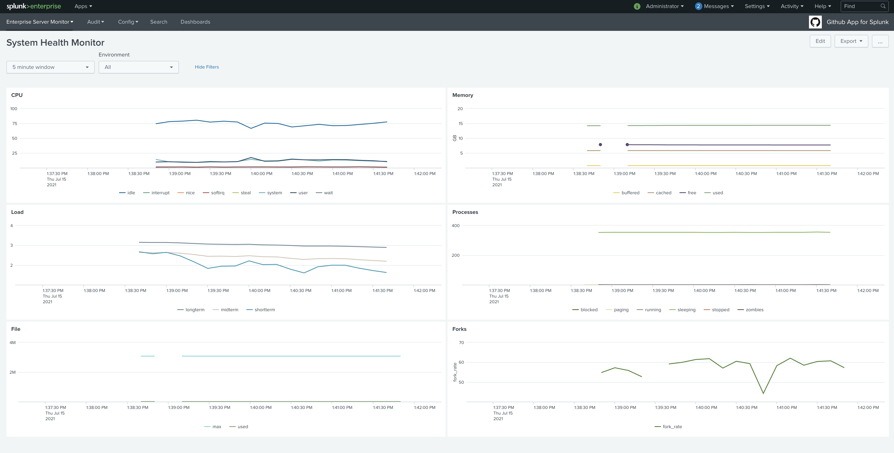
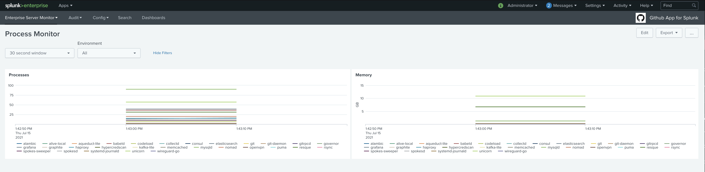

# GitHub App for Splunk

The GitHub App for Splunk is a collection of out of the box dashboards and Splunk knowledge objects designed to give GitHub Admins and platform owners immediate visibility into GitHub.

This App is designed to work across multiple GitHub data sources however not all all required. You may choose to only collect a certain set of data and the parts of this app that utilize that set will function, while those that use other data sources will not function correctly, so please only use the Dashboards that relate to the data you are collecting.

The GitHub App for Splunk is designed to work with the following data sources:

* [GitHub Audit Log Monitoring Add-On For Splunk](./docs/ghe_audit_logs.MD): Audit logs from GitHub Enterprise Cloud.
* [Github.com Webhooks](./docs/github_webhooks.MD): A select set of webhook events like Push, PullRequest, and Repo.
* [Github Enterprise Server Syslog Forwarder](./docs/ghes_syslog_setup.MD): Audit and Application logs from Github Enterprise Server.
* [Github Enterprise Collectd monitoring](./docs/splunk_collectd_forwarding_for_ghes.MD): Performance and Infrastructure metrics from Github Enterprise Server.

## Dashboard Instructions

### Installation

The GitHub App for Splunk is available for download from [Splunkbase](https://splunkbase.splunk.com/app/5596/). For Splunk Cloud, refer to [Install apps in your Splunk Cloud deployment](https://docs.splunk.com/Documentation/SplunkCloud/latest/Admin/SelfServiceAppInstall). For non-Splunk Cloud deployments, refer to the standard methods for Splunk Add-on installs as documented for a [Single Server Install](http://docs.splunk.com/Documentation/AddOns/latest/Overview/Singleserverinstall) or a [Distributed Environment Install](http://docs.splunk.com/Documentation/AddOns/latest/Overview/Distributedinstall).

**This app should be installed on both your search head tier as well as your indexer tier.**

### Configuration

1. The GitHub App for Splunk uses macros so that index and `sourcetype` names don't need to be updated in each dashboard panel. You'll need to update the macros to account for your selected indexes.
1. The macro `github_source` is the macro for all audit log events, whether from GitHub Enterprise Cloud or Server. The predefined macro includes examples of **BOTH**. Update to account for your specific needs.
1. The macro `github_webhooks` is the macro used for all webhook events. Since it is assuming a single index for all webhook events, that is the predefined example, but update as needed.
1. Finally, the macro `github_collectd` is the macro used for all `collectd` metrics sent from GitHub Enterprise Server. Please update accordingly.

### Integration Overview dashboard

There is an *Integration Overview* dashboard listed under *Dashboards* that allows you to monitor API rate limits, audit events fetched, or webhooks received. This dashboard is primarily meant to be used with the `GitHub Audit Log Monitoring Add-On for Splunk` and uses internal Splunk logs. To be able to view them you will probably need elevated privileges in Splunk that include access to the `_internal` index. Please coordinate with your Splunk team if that dashboard is desired.

### Examples

  
Expand for screenshots

#### Audit Log Dashboard

  

#### Repository Audit Dashboard

#### System Health Monitor

#### Process Monitor

## Support

Support for GitHub App for Splunk is run through [GitHub Issues](https://github.com/splunk/github_app_for_splunk/issues). Please open a new issue for any support issues or for feature requests. You may also open a Pull Request if you'd like to contribute additional dashboards, eventtypes for webhooks, or enhancements you may have.
