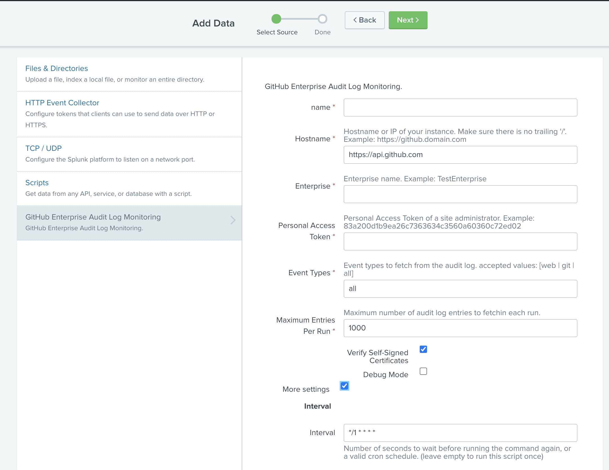
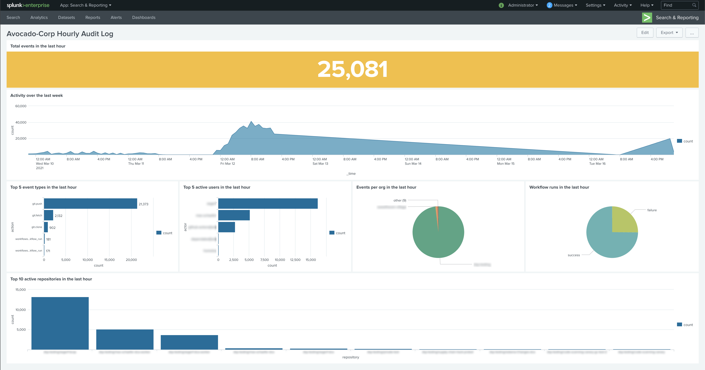

# GitHub Enterprise Audit Log Monitoring

## Prerequisites

- Splunk v8.x+
- Python 3.x

## Installation

Installation and configuration documents for the (Splunk Add-on for GitHub)[https://docs.splunk.com/Documentation/AddOns/released/GitHub/About] is available in our official Splunk docs. This add-on can be used for both GitHub Enterprise Cloud and Server. To configure for each specific environment, please refer to the official docs.

## Configuration

### Personal Access Token Scope

The following are the required scopes for the personal access token allowing the module to fetch the audit log entries successfully:

- [x] admin:enterprise `Full control of enterprises`
  - [x] manage_billing:enterprise `Read and write enterprise billing data`
  - [x] read:enterprise `Read enterprise profile data`

** The PAT must be generated by someone that is an Enterprise Owner**

### Input Fields

- **name**

  - This is name of your instance. You can have multiple modular inputs running simultaneously. However, this is not a recommended behavior for this module.
  - Takes: alpha-numeric, white spaces and symbol characters
  - Example: `GHE-enterprise-name`

- **Hostname**

  - This is the hostname of your GitHub Enterprise instance. Make sure there are no trailing `/` in the URL provided. This could either be a FQDN or an IP address. Do not append any paths beyond the tld. **Most Users Will Not Need to change this!**
  - Example: [https://api.github.com](https://api.github.com)

- **Account Type**
  - This is the type of GitHub account you are using. GitHub Enterprise Cloud users should keep it at `enterprise`, however some users that only have an enterprise tier paid Organization should change it to `organization`. If you can't tell which you have, go to your user icon in GitHub in the upper right corner. If you have an entry listed as "Your enterprises", then you should use `enterprise`, otherwise use `organization`.

- **Enterprise**

  - The enterprise name for which to fetch audit log events

- **Personal Access Token**

  - This is your personal access token that you generate for your or a service account in GitHub Enterprise. This module requires that the personal access token be created with the `site_admin` scope. This is a very sensitive token so make sure to keep it secure at all times!
  - Security: The personal access token is encrypted and stored in Splunk's password storage. After you configure it the first time it will be replaced in Splunk's UI with a unique identifier. This identifier will be used by the module to fetch the personal access token before making the API request to GitHub Enterprise.
  - Takes: a 40 character token
  - Example: `d0e117b6ad471der3rjdowcc401a95d09202119f`

- **Event Types**

  - The audit log contains multiple event types. This field allows you to specify which events to include:
    - web - returns web (non-Git) events
    - git - returns Git events
    - all - returns both web and Git events
  - [More details](https://docs.github.com/en/rest/reference/enterprise-admin#get-the-audit-log-for-an-enterprise)

- **Maximum Entries Per Run**

  - The maximum number of events / entries to fetch each time the script runs. To understand how to calculate the maximum number of entries and interval to best fit your organization go to the [Tweaking throughput](#tweaking-throughput) section below.

- **Verify Self-Signed Certificates**

  - This is a parameter passed to the `get()` method in the `Requests` library. If the checkbox is cheked then the SSL certificate will be verified like a browser does and Requests will throw a SSLError if it’s unable to verify the certificate. Uncheck this box if you are using **self-signed certificates**.

- **Debug Mode**

  - The personal access token will be leaked in the splunkd logs. **DO NOT ENABLE** unless you are ready to update your personal access token.
  - If you are experiencing issues and the module is not operating as intended, you can enable this mode to seethe module's debugging information in the `splunkd` logs.

- **Interval**

  - Takes a `cron expression` as defined in the [Splunk docs](https://docs.splunk.com/Documentation/Splunk/8.1.0/Alert/CronExpressions).
  - Example: `30 * * * *`
    - At minute 30 of every hour. For example, if you set this CRON job at 11:02, your job will begin running at 11:30, 12:30, 1:30, etc...
  - Example: `*/5 * * * *`
    - Every 5 minutes
  - Example: `300`
    - Every 300 seconds or 5 minutes

### Tweaking throughput

This modular input fetches events by calling the [Enterprise Audit Log API](https://docs.github.com/en/rest/reference/enterprise-admin#get-the-audit-log-for-an-enterprise). This API returns a maximum of 100 events / entries per page. The pagination algorithm can fetch events up to the maximum entries per run defined. It's important to tweak the `maximum entries per run` and `interval` parameters to have the ability to fetch your data in a timely manner and stay `as close` to real-time as possible.

**Example:**
| Enterprise   | Events per minute | Maximum entries per run | Interval    | API calls used | Guidance                                                                                                                                                               |
|--------------|-------------------|-------------------------|-------------|----------------|------------------------------------------------------------------------------------------------------------------------------------------------------------------------|
| Evil-Corp    | 1000              | 1000                    | */1* ** * | 600 per hour   | The modular input should be able to handle this with ease.                                                                                                             |
| Poizen-Inc   | 5000              | 5000                    | */1* ** * | 3000 per hour  | We are approaching API rate limit per hour.  Depending on latency, 5000 entries = 50 API calls per minute.  One minute might not be sufficient to fetch all this data. |
| Monsters-Inc | 10000             | 2000                    | */1* ** * | 1200 per hour  | You will be fetching events with a slight delay.                                                                                                                       |

## Use cases

### Activity dashboard example

Along with this modular input we're providing a [GitHub App for Splunk](https://github.com/splunk/github_app_for_splunk) that makes use of the collected audit log events to give you an overview of the activities across your enterprise.

You can install it via the [Manage Apps page](https://docs.splunk.com/Documentation/Splunk/8.2.0/Admin/Deployappsandadd-ons).

Make sure to replace the `[STANZA_NAME]` placeholder with the name of your modular input instance (the first field in the input parameters configured in the previous section).

## FAQs

### How is my Personal Access Token secured?

On the first run the modular input will identify that your personal access token (PAT) is not encrypted. It will encrypt your PAT and store it in Splunk's credentials manager. It will replace the plaintext PAT with an md5 hash of an identifying key.

Your personal access token is only visible in plaintext from the time you configure the modular input instance until the first run.

### Does the interval field access only cron syntax?

No, you can enter the number of seconds instead.

### I enabled debug mode, what now?

If you've enabled debug mode be ready to change your personal access token because it will most likely be leaked into the Splunk logs in plain text.

### Why can't I use a GitHub app instead of a personal access token?

GitHub apps cannot be installed on the enterprise level. The REST API requires enterprise admin privileges which are out of scope for GitHub apps.
