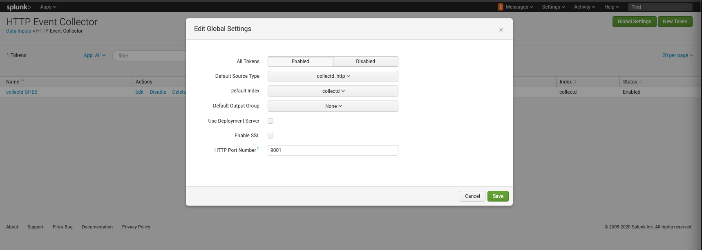
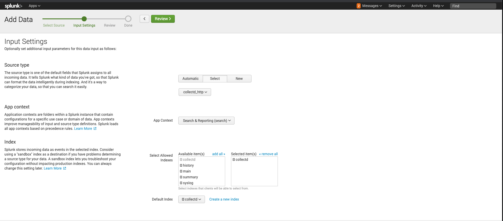
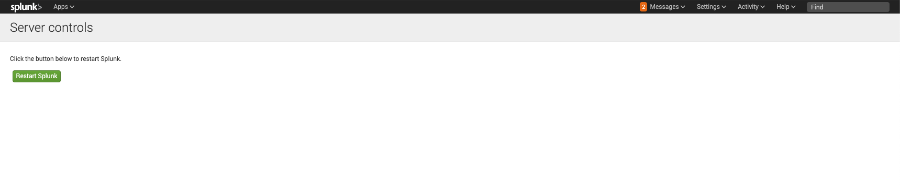

This guide describes how to enable collectd forwarding on GitHub Enterprise Server (GHES) using Splunk Enterprise (v7.0.7).
## Affected products and versions
GitHub Enterprise Server
{: .label }
⚠️⚠️ This is an experimental tutorial to make Splunk compatible with collectd forwarding. Since the tutorial modifies some internal GitHub Enteprise Server files, in case of an update, the configurations need to be applied again. [This feature request](https://github.com/github/customer-feedback/issues/4070) will solve the problem we have in this configuration by adding support for http and JSON format into GitHub Enterprise Server ⚠️
{: .protip .info }
## Collectd configuration for splunk
### Background information
This setup requires some non-standard configuration due to limitations on the current collectd installations. The reasoning are:
- Collectd sends information into `PUTVAL` format, a plain text format, if we use the network plugin (that is the one that gets enabled when you enable the collectd button in GitHub Enterprise Server (GHES) monitoring). This format is not supported by Splunk. To overcome that and get the information, we need to use a different plugin called `write_http`. Find the docs for the plugin [here](https://collectd.org/documentation/manpages/collectd.conf.5.shtml#plugin_write_http)
- The version installed of collectd doesn't support the `Header` parameter, so the configuration requires certain workarounds.
### Splunk configuration
#### Create event collector
We will configure first the [http event collector](https://docs.splunk.com/Documentation/Splunk/8.0.2/Metrics/GetMetricsInCollectd). To do so:
- Open Spunk and click on `Settings > data inputs`
- Under local inputs, select `HTTP Event Collector` (HEC)
- Click on `Global settings`
- Select `All tokens` enabled and **if you don't have ssl enabled in GitHub, untick the** `Enable ssl` option.
- Select the port that you want to use for the events on collectd. In the example we use `9001`

- Close global settings
- Click on `New token`
- Set a name to the collector and click `Next`
- On `Source type` select `Select`. Then under `Metrics` choose `collectd_http`
- On `App context` choose `Search and reporting`
- Choose the index you want to have the data on and the default `index`

- Click on `Review`. If all settings are correct click on `Submit`.
- The new HEC will be created. Copy the token value, we will need this for the GHES configuration.
#### Change authorization settings
In order to send the information from GitHub, we need to enable a feature called `allowQueryStringAuth`. This setting allows us to send the collectd token using a query string parameter instead of a header. We need to enable this because the plugin for collectd we will uses does not support in the installed version (5.5.3) the `Header` parameter ([was introduced in 5.6](https://collectd.org/wiki/index.php/Version_5.6)).
Read more about the option in [the Splunk documentation](https://docs.splunk.com/Documentation/Splunk/6.5.1612/Admin/Inputsconf). To enable it:
- SSH into the Splunk instance
- Go to edit the `inputs.conf` file of Splunk
- Add the parameter `allowQueryStringAuth = true` below the `[http]` option
- Restart the Splunk instance in `settings > server controls > restart Splunk`

Your file would look like:
```text
[ec2-user@ip-172-31-38-192 splunk_httpinput]$ sudo cat local/inputs.conf
[http]
disabled = 0
port = 9001
enableSSL = 0
index = collectd
sourcetype = collectd_http
allowQueryStringAuth = true
```
#### GitHub Enterprise Server configuration
To enable collectd in GitHub Enterprise Server (GHES) to send that to Splunk, **we cannot use the option in the Management console**. Follow these steps to start sending data to Splunk:
- SSH into the GHES console
- Go to `/etc/collectd/conf.d` folder
- Create a file named `splunk.conf` and add the following content:
```text
LoadPlugin write_http
<Plugin write_http>
  <Node "node-http-1">
    URL "http://{{SPLUNK_URL}}:{{SPLUNK_PORT}}/services/collector/raw?token={{SPLUNK_TOKEN}}&sourcetype=http_collectd"
    Format "JSON"
    Metrics true
    StoreRates true
    VerifyPeer {{true|false}}
    VerifyHost {{true|false}}
  </Node>
</Plugin>
```
An the variables with `{{}}` need to be substituted with the right value. The variables are:
- **SPLUNK_URL**: the fully qualified domain where the Splunk instance can be found. Can be also an IP address
- **SPLUNK_PORT**: the port that was enabled in the `Global settings` step. Keep in mind this port should be accessible from GHES to Splunk. If that is not the case, change your network rules to allow this access.
- **SPLUNK_TOKEN**: this is the token obtained when the HEC was configured in the Splunk instructions.
- **Enabling SSL**: SSL is enabled by default. If you don't have SSL enabled in the Splunk instance, make sure `VerifyPeer` and `VerifyHost` are false. We always recommend to use SSL connections when possible.
When the settings are saved (`sudo` is required to change files in this folder), restart the service running:
```bash
sudo systemctl restart collectd
sudo systemctl status collectd
```
Once the server restarts you should be able to see the events coming to Splunk.
### Troubleshooting
#### Collectd log file errors
If you see errors in the collectd log file `/var/log/collectd.log`, this probably means there is a misconfiguration on the url or the service is not reachable through the network. The error looks like:
write splunk plugin: curl_easy_perform failed with status 35
If this happens:
- Review the ssl setting in `Global settings` of Splunk
- Make sure GHES can access the Splunk instance
- Check the port is correctly set and accessible in the security rules of the network
- Review the token and configuration in GHES is correctly set
#### No errors on collectd but no events registered
If this happens probably there is a misconfiguration on the token settings. This means Splunk is accessible from GHES but the request is failing. The http errors are not reported in the collectd log and the option `LogHttpError` is not available in the installed version.
Do a cURL request to Splunk and simulate a data input as follow:
```bash
» curl -k https://{{SPLUNK_URL}}:{{SPLUNK_PORT}}/services/collector/raw\?token\={{SPLUNK_TOKEN}}&sourcetype\=collectd_http   \
-d '[{"values":[164.9196798931339196],"dstypes":["derive"],"dsnames":["value"],"time":1505356687.894,"interval":10.000,"host":"collectd","plugin":"protocols","plugin_instance":"IpExt","type":"protocol_counter","type_instance":"InOctets"}]'
```
If that fails fix the error provided in the response. If that works, check that you are sending the token as a query parameter in the configuration of Splunk and not as a `Header`.
